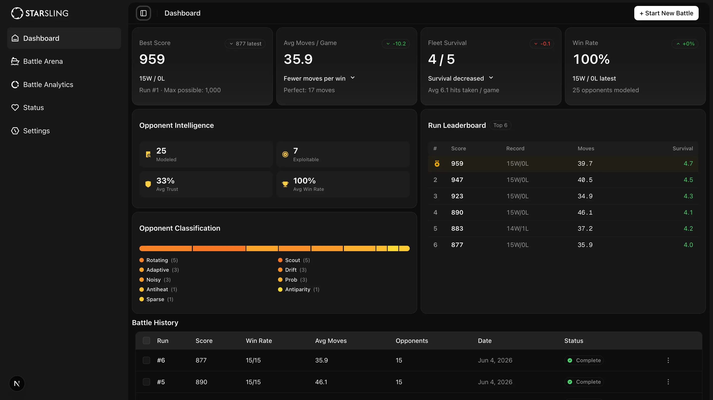

# AEGIS: Adaptive Exploitation & Game Intelligence System        


AEGIS is an autonomous closed-loop battleship agent that detects opponent placement and firing patterns, exploits them through Thompson Sampling and Bayesian inference, and climbs the leaderboard faster with every game it plays. The system includes a full-featured real-time dashboard for monitoring battles, analyzing performance, and reviewing the agent's learning process across multiple runs. It also features an AI-powered chat assistant for strategy and observability questions, and a CLI for launching battles from the terminal.

AEGIS was built for the StarSling Intern Competition, where autonomous agents compete in a series of Battleship games against a diverse roster of opponents. The agent does not receive any prior information about its opponents. Instead, it builds opponent models from scratch, classifies their behavior, computes a trust score for each model, and selects the optimal targeting strategy using a multi-armed bandit. Every decision the agent makes is logged, persisted, and available for real-time visualization in the dashboard.



## Table of Contents

- [How It Works](#how-it-works)
- [The Game: Battleship Rules](#the-game-battleship-rules)
- [Agent Architecture](#agent-architecture)
- [Targeting Strategies](#targeting-strategies)
- [Thompson Sampling Bandit](#thompson-sampling-bandit)
- [Trust System](#trust-system)
- [Opponent Classification](#opponent-classification)
- [Placement Logic](#placement-logic)
- [Memory and Feedback System](#memory-and-feedback-system)
- [Pattern Detection](#pattern-detection)
- [ReAct Decision Loop](#react-decision-loop)
- [Heatmap System](#heatmap-system)
- [Scoring and Performance Metrics](#scoring-and-performance-metrics)
- [JSONL Event Logging](#jsonl-event-logging)
- [Dashboard Application](#dashboard-application)
- [AI Chat Assistant](#ai-chat-assistant)
- [API Routes](#api-routes)
- [Production Architecture](#production-architecture)
- [CLI](#cli)
- [Database Schema](#database-schema)
- [Built With](#built-with)
- [Project Structure](#project-structure)
- [Development Setup](#development-setup)
- [Running Against Production](#running-against-production)
- [Configuration](#configuration)

## How It Works

AEGIS operates as a closed-loop learning system. The term "closed-loop" means that the output of one game directly feeds into the decision-making of the next. The agent does not simply play each game in isolation. Instead, it maintains persistent memory of every opponent it has faced, tracks how their ship placements and firing patterns change over time, and adjusts its own strategy accordingly.

The core loop works as follows:

1. The agent registers with the game server and receives the competition rules, including board size, ship classes, turn timeout, and the opponent roster.
2. For each game within an attempt, the agent retrieves or creates an opponent model from memory.
3. It computes a trust score for the opponent model based on placement stability, prediction accuracy, and sample confidence.
4. It selects a targeting strategy using Thompson Sampling, choosing from probability enumeration, hunt and target, or direct exploitation.
5. It places its own ships defensively, avoiding squares where the opponent is known to fire early.
6. It plays the game move by move, using the ReAct (Reason, Act, Observe) loop to make each firing decision.
7. After the game ends, it records the outcome, updates the opponent model, adjusts the bandit's reward signal, and generates feedback lessons.
8. All state is persisted to disk so the agent can resume learning across multiple runs.

This loop runs for every game in every attempt. Over time, the agent builds increasingly accurate models of each opponent, discovers exploitable patterns, and converges on the most efficient strategy for each matchup.

## The Game: Battleship Rules

AEGIS plays standard Battleship on a 10x10 grid (rows and columns indexed from 0 to 9). Each player places five ships on their board before the game begins:

| Ship       | Size (cells) | Sink Bonus |
| ---------- | ------------ | ---------- |
| Carrier    | 5            | +10        |
| Battleship | 4            | +8         |
| Cruiser    | 3            | +7         |
| Submarine  | 3            | +6         |
| Destroyer  | 2            | +4         |

The total number of ship cells on the board is 17, which means 17 is the theoretical minimum number of moves needed to win a game if every shot is a hit. Ships are placed either horizontally or vertically on the grid. Depending on the competition rules, ships may or may not be allowed to be placed adjacent to each other.

Each turn, the agent fires a shot at a cell on the opponent's board. The server responds with one of three outcomes: HIT (the shot landed on a ship cell), MISS (the shot landed on water), or SINK (the shot destroyed the last remaining cell of a ship, which also identifies the ship class). The game ends when one player sinks all five of the opponent's ships.

Scoring per game is calculated as follows. Each hit and each sink adds to the score, with sink bonuses varying by ship class. If the agent wins, it receives the opponent's base score (14 for SCOUT opponents, 15 for WARSHIP opponents). Penalties are applied for each of the agent's own ships that are sunk during the game. The maximum possible score across all 15 games in an attempt is 1,000.

Each attempt consists of 15 sequential games against 15 different opponents. The agent plays all games in a single attempt, and the total score is the sum of all individual game scores.

## Agent Architecture

The agent is composed of several cooperating subsystems, each responsible for a specific aspect of decision-making:

**Opponent Profiler** handles opponent intelligence. It maintains a per-opponent model that tracks ship placements, firing sequences, game history, and derived metrics like placement stability and prediction accuracy. It classifies opponents into behavioral categories and computes a trust score that gates what strategies are available.

**Defensive Ship Placement** handles where the agent places its own ships. It uses the opponent's historical firing data to identify dangerous squares and places ships in regions where the opponent is least likely to fire. It employs an anti-occupancy prior to further reduce predictability.

**Thompson Bandit Selector** handles strategy selection. For each opponent, it maintains a separate multi-armed bandit with three arms (probability, hunt, exploit). It uses Bayesian inference via Beta distributions to balance exploration of untested strategies with exploitation of known-good strategies.

**Probability Targeting Engine** handles the core shot selection logic. It enumerates all legal ship placements for remaining unsunk ships, weights each cell by how many placements cover it, blends in historical heatmap data, and selects the highest-probability cell as the next target.

**ReAct Decision Loop** handles the per-turn decision cycle. It follows a Reason, Act, Observe pattern where the agent first evaluates the board state, then selects and fires a shot, then processes the outcome to update its internal state.

**Memory and Learning** handles persistence and feedback. After every game, the agent records the outcome, updates the opponent model, adjusts bandit weights, generates feedback lessons, and persists all state to disk for use in future games and future runs.

## Targeting Strategies

The agent has three targeting strategies available, and it selects among them using the Thompson Sampling bandit. Each strategy is suited to different opponent types and game states.

### Probability Enumeration (Default Strategy)

This is the primary targeting strategy and the most mathematically sophisticated. It works by enumerating all legal placements for every remaining unsunk ship on the opponent's board.

For each cell on the board, the strategy counts how many valid ship placements pass through that cell. Cells with higher counts are more likely to contain a ship. The strategy then selects the cell with the highest count as the next target.

Several refinements make this strategy more effective:

**Ship weighting** multiplies each placement's contribution by the ship's sink bonus weight. Carrier placements are weighted at 2.5x, Battleship at 2.0x, Cruiser and Submarine at 1.75x, and Destroyer at 1.0x. This biases the agent toward finding and sinking high-value ships first, maximizing score per move.

**Hunt mode activation** occurs when the agent has active hits (cells that were hit but the ship has not yet been sunk). In hunt mode, the strategy only counts placements that pass through at least one active hit cell. This dramatically concentrates probability mass around known ship locations.

**Orientation inference** kicks in when two or more hits are aligned in the same row or column. The strategy filters out perpendicular placements, focusing entirely on extending along the detected axis. This eliminates wasted shots in the wrong direction.

**Heatmap blending** multiplies the probability counts element-wise with historical ship frequency data from the heatmap. If the opponent tends to place ships in certain regions, those regions receive higher probability even before any shots are fired.

**Random tie-breaking** prevents systematic row-major scanning when the probability map is flat. After a hit-and-sink cycle clears active hits, many cells can have identical probabilities. Without tie-breaking, `max()` would always pick the first cell in row-major order (0,0), then (0,1), and so on, wasting 30 to 40 shots scanning from the top-left. The strategy collects all cells within 1% of the maximum probability and selects one at random, ensuring shots are spread across the board.

The computational complexity is O(n squared times k) where n is the board size (10) and k is the number of remaining ships. This runs in sub-millisecond time, well within the per-turn timeout budget.

### Hunt and Target Strategy

The hunt strategy activates when the agent has confirmed hits to follow up on. It maintains a priority queue of target cells:

**Priority 1: Known targets.** If the agent has identified a fixed placement pattern for the current opponent (through the exploit system), it injects the predicted ship cell locations directly into the target queue. These are fired first.

**Priority 2: Hunt stack.** When a hit is recorded, all adjacent cells (up, down, left, right) that have not been fired on are pushed onto the hunt stack. When two or more hits are aligned, the stack is filtered to only extend along the detected axis.

**Automatic cleanup** removes cells adjacent to fully sunk ships from the hunt stack. This prevents the agent from wasting shots on "ghost" cells that were queued before a ship was identified as sunk.

The hunt strategy is reactive rather than predictive. It excels at finishing off ships once a hit is found but is less efficient than probability enumeration for finding the first hit.

### Exploit Strategy

The exploit strategy is the most aggressive and is only available when the agent has high confidence in an opponent's placement pattern. It works by directly targeting the predicted ship cell locations based on historical placement data.

**Activation criteria** (all must be true):

- Trust score is at least 0.35
- The opponent has been confirmed as having fixed placement with a minimum of 5 games
- Placement stability is above 0.65
- Prediction accuracy is above 0.80 (for opponents with 15+ games; 0.90 otherwise)

These thresholds were tuned aggressively to unlock exploitation earlier in the competition. With 15 opponents and limited attempts, waiting for 8+ games at 0.90 accuracy meant the agent would never exploit some fixed-placement bots in time. The lowered thresholds accept slightly more risk of a miss in exchange for much earlier exploitation.

When these criteria are met, the exploit strategy injects all predicted ship cells as priority targets. In the best case, this allows the agent to sink all ships in exactly 17 moves with zero misses.

**Graceful degradation** handles the case where a predicted placement turns out to be wrong. If the agent fires at a predicted cell and gets a miss, it recognizes that the placement has changed and falls back to the probability strategy for the remainder of the game. The trust score for that opponent will also decrease after the game.

## Thompson Sampling Bandit

Strategy selection uses a Thompson Sampling multi-armed bandit, which is a Bayesian approach to the exploration vs exploitation tradeoff.

### Why Thompson Sampling

The agent needs to decide which targeting strategy to use for each opponent. The challenge is that it has limited data per opponent (typically 1 to 15 games) and needs to balance trying different strategies against using the one that has worked best so far.

Thompson Sampling was chosen over Upper Confidence Bound (UCB) for several reasons. UCB is a frequentist method that requires many samples to converge. Thompson Sampling is Bayesian and works well with as few as 2 to 5 samples. It naturally balances exploration and exploitation through random sampling from posterior distributions. It is also simpler to implement correctly.

### How It Works

The bandit maintains a separate set of three arms for each opponent. Each arm corresponds to a strategy: probability, hunt, or exploit. Each arm tracks cumulative pseudo-wins and pseudo-losses that parameterize a Beta distribution.

When the agent needs to select a strategy, the process is:

1. Check if any arm has been played fewer than 3 times. If so, select uniformly at random from the undersampled arms. This ensures every strategy gets a minimum number of trials before the bandit starts optimizing.

2. If all arms have sufficient samples, draw a random sample from each arm's Beta(wins+1, losses+1) distribution. Select the arm with the highest sample. This naturally balances exploration (arms with high uncertainty get lucky draws) with exploitation (arms with high success rates tend to draw high values).

3. Filter available arms based on trust. If the exploit strategy's activation criteria are not met for this opponent, it is removed from the candidate list before sampling.

### Reward Signal

The reward signal is a composite of three factors, not just win/loss:

```
composite_reward = 0.5 * win + 0.3 * move_efficiency + 0.2 * survival
```

**Win** is 1.0 if the agent won, 0.0 otherwise.

**Move efficiency** is a normalized measure of how quickly the agent won, calculated as `1.0 - (moves - 17) / (80 - 17)`, clamped to the range [0, 1]. Here, 17 is the theoretical minimum moves (all ship cells, no misses) and 80 is a rough upper bound for a reasonable game. A 17-move perfect game yields 1.0 efficiency. A 50-move game yields about 0.48 efficiency.

**Survival** measures how many of the agent's own ships survived, calculated as `max(0, 1 - ships_lost / 5.0)`. Full fleet survival yields 1.0.

The reason for using a composite reward instead of just win/loss is that the agent wins the vast majority of its games. A pure win/loss signal would provide almost no differentiation between strategies. The move efficiency component captures the real performance difference: a 20-move win is dramatically better than a 55-move win, even though both are wins.

The composite reward is converted to pseudo-counts for the Beta distribution: `arm.wins += round(reward * 10)` and `arm.losses += round((1 - reward) * 10)`. This scaling gives the bandit enough granularity to distinguish between good and great performance.

### Bayesian Averaging

When reporting arm statistics, the bandit uses Bayesian averaging with an informative prior. The prior assumes 5 virtual games at 50 moves each. This prevents the bandit from overreacting to a single lucky or unlucky game:

```
avg_moves = (5 * 50.0 + total_moves) / (5 + games)
```

## Trust System

The trust system is the central gating mechanism that controls what information and strategies the agent is allowed to use for each opponent. It prevents the agent from acting on unreliable models and ensures that aggressive strategies like exploitation are only used when the underlying data is trustworthy.

### Trust Computation

Trust is computed as the product of three independent factors:

```
trust = stability * prediction_accuracy * sample_confidence
```

**Stability** (range 0 to 1) measures how consistent the opponent's ship placements are across games. It is calculated as the average Jaccard similarity between consecutive placement observations. The Jaccard similarity between two sets is the size of their intersection divided by the size of their union. If an opponent places ships in exactly the same cells every game, stability is 1.0. If placements are completely random, stability approaches 0. Recent games are weighted more heavily: if the last 3 games show a significant drop in similarity compared to earlier games, a penalty is applied to detect drift.

**Prediction accuracy** (range 0 to 1) measures how well the agent's heatmap predictions match the opponent's actual most recent placement. It compares the top 17 cells predicted by the heatmap against the actual ship cells observed. If prediction accuracy cannot be computed (fewer than 2 placement observations), a fallback is used: if stability is above 0.9 and at least 2 games have been played, stability itself is used as a proxy for prediction accuracy.

**Sample confidence** (range 0 to 1) scales with the number of games played against the opponent. The formula is `min(games_played / 10.0, 1.0)`. After 10 games, sample confidence is maxed out at 1.0. After just 1 game, it is only 0.1, ensuring the agent does not over-trust a model built from a single observation.

### Trust Thresholds

The trust score gates access to increasingly aggressive capabilities:

| Trust Level | Range          | Capabilities                                                                                                                                               |
| ----------- | -------------- | ---------------------------------------------------------------------------------------------------------------------------------------------------------- |
| Untrusted   | Below 0.15     | No heatmap blending, no exploit, no memory priors. The agent plays as if it has never seen this opponent.                                                  |
| Low trust   | 0.15 to 0.35   | Weak heatmap boost applied (weight = trust \* 5, so 0.2 trust yields 1.0x heatmap weight). Dangerous square avoidance and top-row hard-avoid enabled for placement. No exploit.   |
| Trusted     | 0.35 and above | Full heatmap blending (8.0x boost at trust >= 0.7). Exploit strategy becomes available if other criteria (stability above 0.65, prediction accuracy above 0.80, 5+ games) are also met. |

### Model Reset

If the agent detects that an opponent's model has become severely unreliable (prediction accuracy below 0.15, performance is degrading, and at least 4 games have been played), it resets the opponent's history entirely. The trust score drops to 0 and the agent starts fresh, as if encountering the opponent for the first time. This prevents the agent from being trapped by a model that was once accurate but has become misleading due to opponent adaptation.

## Opponent Classification

The agent classifies each opponent into one of several behavioral categories. Classification is primarily extracted from the opponent's ID prefix (the server assigns descriptive IDs), with fallback heuristics for unknown opponents.

### Classification Types

**Scout** opponents are lightweight reconnaissance bots. They use simple, often predictable targeting patterns and typically have lower base scores (14 points). They are generally the easiest to defeat and exploit.

**Rotating** opponents cycle through N fixed ship layouts. Unlike purely fixed opponents, they switch between multiple known configurations. This breaks naive exploitation: an agent that memorizes a single layout will fail when the opponent switches to a different one. The agent handles this by tracking multiple placement observations and using the heatmap to aggregate across all seen layouts.

**Drift** opponents shift their ships slightly each game. Their placements are not random but are not fully fixed either. Each game, ships move a small number of cells from their previous positions. This creates moderate stability scores and requires the heatmap to generalize rather than memorize exact positions.

**Noisy** opponents are 90% deterministic and 10% random. Nine out of ten games, they use a fixed layout. The tenth game, they randomize entirely. This is specifically designed to defeat exploitation: an agent that perfectly predicts the fixed layout will occasionally fire at empty water and waste moves. The trust system handles this by slightly penalizing prediction accuracy when occasional mismatches occur.

**Adaptive** opponents learn from the player's shots and relocate their ships to avoid frequently targeted areas. They represent the most challenging opponent type because their behavior changes in response to the agent's own actions. The agent's drift detection and model reset mechanisms are specifically designed to handle this case.

**Probability** opponents are strong bots that use occupancy-based targeting, similar to the agent's own probability enumeration strategy. They are effective at finding and sinking the agent's ships quickly, making defensive placement especially important in these matchups.

**Anti-heatmap** opponents intentionally place ships in the regions where the agent (or any heatmap-based opponent) is least likely to look. They cycle through bottom-right, top-left, and center regions across games. This directly counters heatmap-based targeting and requires the agent to fall back on pure probability enumeration.

**Sparse** opponents spread their ships across different quadrants of the board, minimizing the chance that a single cluster of shots will find multiple ships. This increases the average number of moves needed to win.

**Anti-parity** opponents favor cells where (row + column) modulo some parity value equals a specific target. This exploits the fact that many battleship strategies use parity-based search patterns (only firing on cells of one "color" in a checkerboard pattern). Anti-parity placement puts ships on the cells that parity-based search would skip.

**Unknown** is the fallback classification for opponents whose ID does not match any known prefix. For unknown opponents, the agent uses behavioral heuristics based on observed stability: if placement is fully fixed, the opponent is classified as "fixed"; if placement stability is at least 0.4, it is classified as "semi_fixed"; otherwise, it is classified as "unstable".

## Placement Logic

Defensive ship placement determines where the agent's own ships go at the start of each game. The goal is to place ships where the opponent is least likely to fire, especially in the early turns of the game.

### Top-Row Hard Avoidance

Before generating candidate placements, the agent analyzes the opponent's opening shot heatmap. If the opponent concentrates more than 55% of early-turn fire in the top 3 rows (rows 0 to 2), those 30 cells are added to the hard-avoid set. If more than 70% falls in the top 4 rows, row 3 is also avoided. This is a blanket defense against top-scanning opponents, which are common in the competition roster. The avoidance is computed from at least 3 observed firing sequences to avoid reacting to noise.

### Three-Phase Placement

Placement uses a multi-phase approach with progressive constraint relaxation:

**Phase 1: Full constraints.** The placer respects the dangerous squares avoidance set (cells where the opponent frequently fires in early turns) plus the top-row hard-avoid set, maintains a 1-cell buffer between ships, and requires all cells to be on the board. Up to 500 random attempts are made. If a valid placement is found, it is used.

**Phase 2: Relax buffer.** If Phase 1 fails (the board is too constrained), the buffer requirement is dropped and ships are allowed to be placed adjacent to each other. The dangerous squares avoidance set is still respected. This phase is only used when the competition rules allow adjacency. If adjacency is forbidden by the rules, this phase is skipped entirely.

**Phase 3: Relax avoidance.** If Phase 2 also fails, the dangerous squares avoidance set is ignored entirely. The placer now only needs to find a non-overlapping placement that fits on the board. This is the last resort and should almost never be needed.

### Scoring Based on Opponent Shot Frequency

When the opponent's shot frequency map is available (trust at least 0.15), the placer generates 50 random candidate placements and scores each one. The score is the sum of the opponent's shot frequency values at every cell occupied by a ship. The placement with the lowest score is selected, meaning ships are placed in the regions where the opponent fires least often.

### Anti-Occupancy Prior

The placer also uses an anti-occupancy prior to reduce predictability against probability-based opponents. The anti-occupancy prior computes, for each cell, how many legal random ship placements would pass through that cell. Center cells have the highest occupancy density (many placements cover them) while edge and corner cells have the lowest. The placer inverts this: it biases ship placement toward low-density cells, which are exactly the cells that a probability-based opponent would assign the lowest probability to.

A small amount of noise (uniform random multiplier between 0.8 and 1.2) is applied to the anti-occupancy prior each game. This prevents the placement from becoming deterministic and therefore exploitable by an adaptive opponent.

### Edge-Biased Randomization

When generating random candidate placements, the starting coordinates are edge-biased: there is a 60% chance of placing a ship's starting cell on one of the outer two rows or columns, and a 40% chance of placing it anywhere on the board. This creates a slight preference for edge placement, which is advantageous because probability-based opponents assign higher density to center cells.

## Memory and Feedback System

The agent maintains persistent memory across games and across runs. This is what makes the agent "closed-loop": information gained in one game directly improves performance in subsequent games.

### Opponent Memory

For each opponent, the agent stores:

**Ship placements** (up to 30 games of history): The exact cells occupied by each of the opponent's ships, recorded after the game ends. This is the raw data used to compute heatmaps, stability, and prediction accuracy.

**Firing sequences** (up to 30 games of history): The sequence of cells the opponent fired at, in order. This is used to detect fixed firing patterns and compute dangerous squares for defensive placement.

**Move history**: The number of moves the agent took in each game against this opponent. This is used to detect performance trends (improving, degrading, or stable).

**Win/loss counters**: Total games played, wins, and losses against this opponent.

All memory is persisted to `data/memory.json` as a JSON dictionary keyed by opponent ID. When the agent starts a new run, it loads this file and immediately has access to everything it learned in previous runs.

### Feedback System

The feedback system generates structured lessons after each game. Lessons are actionable insights that the agent can apply in future games.

**Lesson types**:

- `PLACEMENT_EXPLOIT`: A fixed placement pattern has been confirmed for this opponent. The agent can target known ship locations directly. Confidence is computed as `min(0.95, (0.5 + games * 0.15) * max(win_rate, 0.3))`.

- `FIRING_DODGE`: A fixed firing pattern has been detected for this opponent. The agent should avoid placing ships in the cells the opponent targets early. This directly feeds into the dangerous squares computation for placement.

Timing lessons (`TIMING_OK` and `TIMING_RISK`) were removed as they generated pure noise: the agent's average decision time of 70 to 126ms is well within the 10,000ms turn timeout, and the lessons provided no actionable signal.

Each lesson includes a confidence score, the number of games it is based on, baseline and result metrics, improvement gain, and an application counter. Lessons are persisted to `data/lessons.json`.

### Lesson Generation Triggers

After every game, the feedback engine evaluates whether new lessons should be generated:

- A placement exploit lesson is generated when the opponent is confirmed as having fixed placement with at least 5 games of data.
- A firing dodge lesson is generated when the opponent is confirmed as having fixed firing with at least 5 games of data.

Lessons are deduplicated by type and opponent. If a lesson already exists for an opponent and type, it is updated rather than duplicated.

## Pattern Detection

Pattern detection is the subsystem that identifies exploitable regularities in opponent behavior. It operates continuously as games are played and feeds its results into the trust system and strategy selection.

### Placement Stability

Placement stability measures how consistent an opponent's ship placements are across games. It is computed as the average Jaccard similarity between consecutive pairs of observed placements:

```
For each pair of consecutive games (i, i+1):
  similarity = |placement_i intersection placement_{i+1}| / |placement_i union placement_{i+1}|

stability = mean(all pairwise similarities)
```

A penalty is applied if recent games show lower similarity than older games. If the average similarity of the last 3 games drops more than 0.1 below the overall average, the trust system reduces its confidence. This catches opponents that start with fixed placement and then switch to adaptive behavior.

### Fixed Placement Detection

An opponent is flagged as having fixed placement when the following conditions are met:

- At least `min_games` observations exist (default 8 for exploitation, 5 for feedback lessons)
- Placement stability exceeds 0.75
- The most recent placement matches the historical pattern

### Fixed Firing Detection

Similarly, the agent checks whether an opponent fires in the same sequence each game. Fixed firing detection compares the first N shots across multiple games (where N is the median game length, capped at 25 turns) and checks if they match consistently.

### Dangerous Squares

Dangerous squares are cells where the opponent tends to fire in the early turns of a game. They are computed using a turn-weighted frequency analysis:

```
For each shot the opponent has fired:
  score[cell] += 1 / (turn + 1)
```

This means a shot fired on turn 0 has a weight of 1.0, while a shot fired on turn 5 has a weight of about 0.167. Early shots matter roughly 6 times more than late shots because a ship hit early means more cells lost before the agent can sink the opponent.

A cell is flagged as dangerous if its frequency score exceeds `0.5 * games_played`. The agent avoids placing ships on these cells.

### Degradation Detection

The agent monitors whether its performance against a specific opponent is getting worse over time. If the last 3 move counts are monotonically increasing (each game takes more moves than the previous one), the opponent is flagged as degrading. This typically indicates that the opponent is adapting to the agent's strategy, and the agent should consider resetting its model.

## ReAct Decision Loop

The ReAct (Reason, Act, Observe) loop is the per-turn decision framework that controls the agent's behavior during a game. It is inspired by the ReAct paradigm from language model agents, adapted for the structured environment of Battleship.

### Reason Phase

Before each shot, the agent evaluates the current board state. It checks:

- Are there active hits (hit cells where the ship has not been sunk yet)?
- Is the current strategy still appropriate, or should it switch?
- Are there pre-computed targets from the exploit system?

If active hits exist and the current strategy is probability enumeration, the agent may switch to hunt mode to focus on finishing the ship. If exploit targets are exhausted or producing misses, the agent falls back to probability enumeration.

### Act Phase

The agent queries the selected targeting strategy for the next move. The targeting strategy returns the highest-priority cell to fire at. The agent submits the shot to the game server.

### Observe Phase

After the server responds with the shot outcome (hit, miss, or sunk), the agent updates its internal state:

- If hit: the cell is added to the active hits set, and adjacent cells are added to the hunt stack.
- If miss: the cell is marked as water on the internal board.
- If sunk: the ship is removed from the remaining ships list, and the hunt stack is cleaned up to remove cells adjacent to the sunk ship.

### Pre-computation

To minimize latency and avoid timeout warnings, the ReAct loop uses pre-computation. After submitting the current shot to the server (which involves an HTTP round trip), the agent immediately computes what its next move would be for each possible outcome (hit, miss, sunk). By the time the server responds, the next move is already prepared. This parallelizes compute time with network latency and keeps the agent well within the turn timeout budget.

## Heatmap System

The heatmap system aggregates historical placement data for each opponent into a 10x10 frequency grid. Each cell contains the fraction of games in which that cell was occupied by an opponent ship.

### Construction

For each game in the opponent's history, the heatmap records which cells were occupied by ships. The frequency for each cell is `count / total_games_observed`. If an opponent always places a ship on cell (3, 4), that cell's frequency is 1.0. If the opponent is completely random, all cells that could be occupied would have frequencies around 0.17 (17 ship cells divided by 100 board cells).

### Stability Metric

The heatmap computes its own stability metric:

```
nonzero = all frequency values that are greater than 0
stability = mean(nonzero squared)
```

For a perfectly fixed placement (all occupied cells have frequency 1.0), stability is 1.0. For a random placement (all cells have roughly equal low frequency), stability approaches 0.04. This metric feeds into the trust computation.

### Blending with Probability

During targeting, the probability counts from the enumeration strategy are multiplied element-wise with the heatmap frequencies, scaled by the heatmap weight:

```
heatmap_weight = trust * 5.0
blended_score[cell] = probability_count[cell] * (1 + heatmap_weight * heatmap_frequency[cell])
```

At trust 0.2, the heatmap weight is 1.0, providing a gentle nudge. At trust 0.8, the weight is 4.0, strongly biasing toward historically observed positions. For high-trust opponents (trust at or above 0.7), the heatmap weight is boosted to 8.0, reflecting near-certainty about the opponent's placement habits. At trust below 0.15, the heatmap is not used at all.

## Scoring and Performance Metrics

### Per-Game Scoring

Each game is scored as follows:

```
score = 0
For each shot fired:
  if outcome is HIT or SINK: score += 1
  if outcome is SINK: score += sink_bonus[ship_class]
If the agent won: score += opponent_base_score (14 for SCOUT, 15 for WARSHIP)

For each of the agent's ships that was sunk:
  score -= (2 + sink_bonus[ship_class])
```

The maximum score for a single game varies by opponent type but is roughly 70 to 75 points. The maximum total score across all 15 games in an attempt is 1,000.

### Tracked Metrics

The agent tracks the following metrics per attempt:

- Total games played, wins, and losses
- Moves per game (list, for computing average and distribution)
- Move times in milliseconds (list, for latency analysis)
- Improvement deltas (difference in moves compared to previous best against each opponent)
- Patterns detected (count of new pattern discoveries)
- Strategy changes (count of mid-game strategy switches)
- Timeout warnings (moves that approached 70% of the turn timeout)
- Errors (recoverable issues encountered)
- Per-opponent breakdowns (games, wins, moves, ships lost, hits received)
- Trust scores per opponent
- Classification per opponent
- Stability per opponent

### Key Performance Indicators

The dashboard surfaces these as KPI cards:

- **Best Score**: The highest total score across all historical runs
- **Avg Moves per Game**: Lower is better (17 is perfect, typical range is 30 to 55)
- **Fleet Survival**: Average ships surviving per game out of 5 (higher is better)
- **Win Rate**: Percentage of games won (target is 100%)

## JSONL Event Logging

Every significant event during a run is logged to a JSONL (JSON Lines) file at `data/battles/{battleId}.jsonl`. Each line is a self-contained JSON object with a timestamp, event type, attempt number, and event-specific data.

### Event Types

| Event              | When                       | Key Data                                                                                            |
| ------------------ | -------------------------- | --------------------------------------------------------------------------------------------------- |
| `run_started`      | Engine initializes         | Configuration, competition ID                                                                       |
| `registered`       | Rules received from server | Turn timeout, number of opponents, ship classes                                                     |
| `attempt_started`  | New attempt begins         | Attempt number                                                                                      |
| `game_started`     | Game within attempt begins | Game number, opponent ID, known placement/firing flags, strategy chosen                             |
| `move`             | Each shot fired            | Turn number, row, column, result, elapsed milliseconds, strategy, confidence                        |
| `pattern_detected` | Exploitable pattern found  | Opponent ID, pattern type, games confirmed, detail                                                  |
| `strategy_changed` | Mid-game strategy switch   | Old strategy, new strategy, reason                                                                  |
| `game_ended`       | Game completes             | Won/lost, total moves, avg latency, improvement delta, ships lost, hits received, enemy cells left  |
| `memory_updated`   | Opponent model persisted   | Opponent ID, trust score, stability, classification                                                 |
| `attempt_ended`    | All 15 games complete      | Wins, losses, per-game summaries                                                                    |
| `learning_curve`   | Cross-attempt trend        | Aggregated win rate and move trends across attempts                                                 |
| `run_ended`        | Engine shuts down          | Final statistics                                                                                    |

The JSONL file is line-buffered and append-only, which allows the dashboard to stream events in real time by polling the file for new lines.

## Dashboard Application

The dashboard is a Next.js web application that provides real-time monitoring, historical analytics, and opponent intelligence visualization for the AEGIS agent.

### Pages

**Home (/)**: Landing page with hero section, animated background, and call-to-action buttons. Features a video dialog with project banner, a logo marquee, five feature sections (Analytics, Battle Arena, Dashboard, Chat, CLI), and a CTA section. Links to the competition, GitHub, and the dashboard.

**Dashboard (/dashboard)**: The main overview page. Displays four KPI cards (Best Score, Avg Moves per Game, Fleet Survival, Win Rate) with delta indicators comparing the latest run to the previous run. Below the KPIs, the page shows an Opponent Intelligence section with stats (total modeled, exploitable count, avg trust, avg win rate), a classification distribution bar with tooltips showing which block belongs to which opponent class, and a run leaderboard. At the bottom is a Battle History table showing all runs with clickable rows that navigate to the analytics page. The table includes a "Download logs" action in the three-dot menu for each run, which downloads the raw JSONL battle log as a formatted text file. A floating AI chat bar is available for asking strategy and observability questions.

**Battle Arena (/battle-arena)**: 

The live battle monitoring page. When a battle is started, this page connects to a Server-Sent Events (SSE) stream and displays the agent's decision-making process in real time. The left side shows an interactive workflow canvas with six agent nodes (Opponent Profiler, Defensive Ship Placement, Thompson Bandit Selector, Probability Targeting Engine, ReAct Decision Loop, Memory and Learning), each with three child nodes that light up as the corresponding events are received. The right side shows a scrolling log panel with timestamped, color-coded battle events. When the battle completes, a "Get Battle Analysis" button appears in the header.

**Battle Analytics (/battle-analytics)**: 


When accessed without a battle ID, this page shows the Battle History table for selecting a run to analyze. When accessed with a battle ID (e.g., `/battle-analytics?id=<uuid>`), it displays comprehensive analytics including KPI cards (Win Rate, Avg Moves, Avg Latency, Patterns Found, Total Score), a Cumulative Win Rate chart with overlays from up to 15 historical runs, a Move Efficiency chart comparing actual moves to baseline with historical overlays, strategy comparison radar and distribution donut charts, a latency distribution histogram, a per-opponent win rate bar chart, an Opponent Intelligence table with classification, trust scores, and exploitability indicators, and an Agent Feedback Loop section showing detected patterns and lessons. A floating AI chat bar is also available on this page for contextual questions about the battle results.

### Real-Time Battle Streaming

The battle arena uses Server-Sent Events (SSE) for real-time updates. The flow is:

1. The user clicks "Start New Battle" and confirms deployment through a countdown dialog (3, 2, 1).
2. The frontend creates a new battle record in Supabase and sends a POST request to `/api/battle/start`, which spawns the Python engine as a subprocess.
3. The engine writes JSONL events to a file as it plays.
4. The frontend opens an EventSource connection to `/api/battle/logs?id=<battleId>`, which polls the JSONL file every 500ms and streams new lines as SSE events.
5. Each event updates the workflow canvas node statuses and appends to the log panel.
6. When a `run_ended` event is received, the stream closes and the analysis button becomes available.

The EventSource connection uses a `useRef` (not `useState`) for tracking the connection state. This is important because using `useState` would cause the React useEffect cleanup to fire on every state change, immediately closing the EventSource after it opens. The `useRef` approach avoids this race condition.

### Charts and Visualizations

All charts use ApexCharts (via react-apexcharts) with a dark theme:

- **Cumulative Win Rate**: Area chart with gradient fill showing win rate progression across games. Historical runs are overlaid as dashed grey lines for comparison.
- **Move Efficiency**: Line chart showing actual moves per game vs baseline, with historical run overlays.
- **Strategy Comparison**: Radar chart comparing strategies across four dimensions (win rate, efficiency, games played, consistency).
- **Strategy Distribution**: Donut chart showing the proportion of games played with each strategy.
- **Latency Distribution**: Vertical bar histogram with six buckets (0-5ms, 5-10ms, 10-15ms, 15-25ms, 25-50ms, 50ms+).
- **Per-Opponent Win Rate**: Horizontal bar chart with color-coding for exploited vs non-exploited opponents.

## AI Chat Assistant


AEGIS includes a floating chat bar on the Dashboard and Battle Analytics pages, powered by OpenRouter with GPT-4.1. The chat assistant uses this README as its knowledge base, allowing users to ask questions about the agent's strategies, architecture, and performance.

### How It Works

The chat bar appears as a floating input at the bottom of the page. When the input is focused, a footer text appears indicating the AI model in use. The assistant maintains full conversation history within the session.

On the backend, the `/api/chat` route loads this README file at cold-start and sends it as a system prompt to the OpenRouter API alongside the user's conversation. The system prompt instructs the model to answer questions about AEGIS's strategies, trust system, bandit, placement, targeting, and dashboard features. For observability questions, the assistant mentions that users can download battle logs for further analysis by clicking the three-dot icon and selecting "Download logs" from the Battle History table.

Responses are rendered with markdown formatting using react-markdown with Tailwind Typography prose styling, so code blocks, lists, and formatted text display correctly in the chat interface.

### Technical Details

- Model: OpenAI GPT-4.1 via OpenRouter
- Knowledge base: This README file, loaded once at server cold-start
- Conversation: Full history maintained per session (not persisted across page reloads)
- Visibility: The footer text below the chat input uses CSS opacity toggle rather than conditional rendering to prevent layout shift when focusing/unfocusing the input

## API Routes

The dashboard exposes several API routes under `/api/battle/` and `/api/chat/`:

### POST /api/battle/start

Creates a new battle and spawns the Python engine. In local development, it spawns the engine as a subprocess directly. In production (Vercel), it proxies the request to the FastAPI backend on Render at `POST /engine/start`, which spawns the engine there. Accepts `{ battleId: string }` in the request body. Returns `{ ok: true, battleId: string }`.

### GET /api/battle/logs?id={battleId}

Server-Sent Events endpoint that streams battle events in real time. In local development, it polls the JSONL log file every 500ms. In production, it proxies the SSE stream from the FastAPI backend at `GET /engine/logs?id={battleId}`. Each new line is parsed as JSON and sent as an SSE event. The stream closes automatically when a `run_ended` event is detected.

### GET /api/battle/analytics?id={battleId}

Returns a comprehensive analytics JSON response for a completed battle. The endpoint uses a three-tier fallback for obtaining the raw JSONL log: (1) local filesystem in development mode, (2) the FastAPI backend at `GET /engine/raw-log?id={battleId}` in production, (3) the `battle_logs` table in Supabase if neither of the first two sources has the file. This ensures analytics work regardless of whether the battle was run locally or on Render. The endpoint parses the log to extract game records, patterns, memory updates, and strategy switches. It also queries Supabase for the total score and up to 15 historical runs with per-game data. The response includes KPIs, game timeline data, historical run comparisons, strategy statistics, latency distribution, per-opponent statistics, and agent lessons.

### GET /api/battle/download?id={battleId}

Downloads the raw JSONL battle log as a formatted text file. In local development, it reads the file directly. In production, it fetches from the FastAPI backend at `GET /engine/download?id={battleId}`. Each JSON line is pretty-printed and separated by horizontal rules for readability.

### POST /api/chat

Handles chat messages for the AI assistant. Loads this README as the system prompt knowledge base, sends the conversation to OpenRouter GPT-4.1, and returns the assistant's response. The endpoint maintains the full conversation history passed from the client.

## Production Architecture

AEGIS uses a split architecture for production deployment:

**Frontend (Vercel)**: The Next.js dashboard is deployed on Vercel as a serverless application. Vercel's serverless functions cannot spawn Python subprocesses or access a persistent filesystem, so all engine operations are proxied to the backend.

**Backend (Render)**: The FastAPI backend is deployed on Render as a persistent service at `https://aegis-n8at.onrender.com`. It hosts both the mock game server (25 bot opponents) and four engine proxy endpoints:

- `POST /engine/start`: Spawns the Python engine subprocess and returns immediately
- `GET /engine/logs`: Streams the JSONL log file as Server-Sent Events via Starlette StreamingResponse
- `GET /engine/download`: Returns the formatted battle log as a text file download
- `GET /engine/raw-log`: Returns the raw JSONL content for analytics parsing

**How it works**: Each Next.js API route checks whether `ENGINE_SERVER_URL` points to localhost. If it does, it operates directly on local files and subprocesses. If it points to Render, it proxies the request to the corresponding `/engine/*` endpoint. The analytics route additionally falls back to Supabase's `battle_logs` table when neither the filesystem nor Render has the log file. This allows the same codebase to run in both local development and production without any code changes.

After each completed run, the reporter uploads the raw JSONL log to Supabase alongside the usual run metrics, game records, and opponent state. This ensures that analytics are available on Vercel even for battles that were run locally or when Render's ephemeral filesystem has been recycled.

**Competition Server**: For prod competition play, the agent connects directly to `https://intern-battleship-game-server.vercel.app` using the Agent Auth protocol. The agent authenticates via `@auth/agent-cli`, receives a fresh single-use JWT per request, and plays 15 games per attempt against the competition's fixed opponent roster.

## CLI

AEGIS includes a CLI for launching battles from the terminal without the dashboard.

### Shell Script (`cli/run.sh`)

A convenience script that sets up the environment and runs the engine:

```bash
# Production (against Render backend)
./cli/run.sh

# Local development (against localhost:5001)
./cli/run.sh --local
```

The script auto-creates a Python virtual environment and installs dependencies if needed.

### Python Entry Point (`engine/play.py`)

The primary entry point for playing against the real competition server:

```bash
# First run: approve agent via device authorization flow
python -m engine.play --connect

# Play one attempt against prod
python -m engine.play

# Play multiple self-improving attempts
python -m engine.play --rounds 5

# Check score history
python -m engine.play --history

# Use mock server instead
python -m engine.play --mock
```

Features:
- Separate data directories for mock (`data/`) and prod (`data/prod/`) to prevent cross-contamination
- Auto-retry on disqualification (up to 3 retries per round, disable with `--no-retry`)
- Score tracking across attempts in `scores.jsonl` with timestamps, win/loss, and win rate
- Cross-attempt learning: opponent memory, bandit state, and feedback lessons persist between attempts, so the agent improves with each run

## Database Schema

AEGIS uses Supabase (PostgreSQL) with five tables:

### Battles Table

Stores one row per battle simulation session.

| Column       | Type        | Description                              |
| ------------ | ----------- | ---------------------------------------- |
| id           | bigint      | Auto-incrementing primary key            |
| battle_id    | uuid        | Unique battle identifier, auto-generated |
| created_at   | timestamptz | Creation timestamp                       |
| status       | text        | Current status ("running" or "complete") |
| completed_at | timestamptz | Completion timestamp (nullable)          |

### Runs Table

Stores one row per attempt within a battle.

| Column           | Type   | Description                            |
| ---------------- | ------ | -------------------------------------- |
| id               | bigint | Auto-incrementing primary key          |
| battle_id        | uuid   | Foreign key to battles table           |
| attempt_num      | int    | Attempt number within the battle       |
| total_score      | int    | Sum of all game scores in this attempt |
| wins             | int    | Number of games won                    |
| losses           | int    | Number of games lost                   |
| total_games      | int    | Total games played (wins + losses)     |
| avg_moves        | real   | Average moves per game                 |
| avg_ms           | real   | Average milliseconds per move          |
| ships_surviving  | real   | Average ships surviving per game       |
| hits_taken       | real   | Average hits received per game         |
| move_savings     | int    | Total moves saved compared to baseline |
| timeout_warnings | int    | Number of timeout warnings             |
| errors           | int    | Number of recoverable errors           |
| status           | text   | Run status (default "complete")        |

### Games Table

Stores one row per game within a run.

| Column        | Type        | Description                                |
| ------------- | ----------- | ------------------------------------------ |
| id            | bigint      | Auto-incrementing primary key              |
| battle_id     | uuid        | Foreign key to battles table               |
| run_id        | bigint      | Foreign key to runs table                  |
| opponent_id   | text        | Opponent identifier string                 |
| won           | boolean     | Whether the agent won this game            |
| moves         | int         | Total moves taken in this game             |
| ships_lost    | int         | Number of agent ships sunk                 |
| hits_received | int         | Number of hits taken by agent              |
| strategy      | text        | Strategy used (probability, hunt, exploit) |
| trust         | real        | Trust score for this opponent at game time |
| created_at    | timestamptz | Game completion timestamp                  |

### Opponents Table

Stores the latest aggregated state per opponent (upserted after each run).

| Column         | Type        | Description                                              |
| -------------- | ----------- | -------------------------------------------------------- |
| id             | bigint      | Auto-incrementing primary key                            |
| battle_id      | uuid        | Foreign key to battles table                             |
| opponent_id    | text        | Unique opponent identifier                               |
| classification | text        | Behavioral classification (scout, rotating, drift, etc.) |
| stability      | real        | Placement stability score (0 to 1)                       |
| trust          | real        | Computed trust score (0 to 1)                            |
| games_played   | int         | Total games played against this opponent                 |
| wins           | int         | Total wins against this opponent                         |
| win_rate       | real        | Win rate as a decimal (0 to 1)                           |
| avg_moves      | real        | Average moves per game against this opponent             |
| best_moves     | int         | Best (lowest) moves achieved against this opponent       |
| avg_survival   | real        | Average ships surviving against this opponent            |
| exploitable    | boolean     | Whether this opponent has an exploitable pattern         |
| updated_at     | timestamptz | Last update timestamp                                    |

### Battle Logs Table

Stores raw JSONL log content per battle, enabling the analytics route to serve battle data from Supabase when the log file is not available on the local filesystem or Render. The reporter uploads the log after each completed run. A backfill script (`scripts/backfill_logs_to_supabase.py`) is provided to upload existing local logs.

| Column     | Type        | Description                                     |
| ---------- | ----------- | ----------------------------------------------- |
| id         | bigint      | Auto-incrementing primary key                   |
| battle_id  | uuid        | Unique reference to battles table (unique)      |
| raw_jsonl  | text        | Full JSONL log content                          |
| created_at | timestamptz | Upload timestamp                                |

## Built With

### Engine (Python)

- **Python 3.12** with type hints throughout
- **NumPy** for probability matrix operations, heatmap computation, and anti-occupancy priors
- **requests** for HTTP communication with the game server
- **Rich** for terminal UI rendering during development
- **Supabase Python SDK** for persisting run results to the database
- **@auth/agent-cli** (Node.js) for Agent Auth device authorization and JWT signing

### Dashboard (TypeScript)

**Frontend Framework**

- Next.js 16.1.6 with React 19 and App Router
- TypeScript 5
- Tailwind CSS 4 with @tailwindcss/typography for prose styling

**UI Components**

- shadcn/ui (Radix-based component library)
- Radix UI primitives (tooltip, dialog, sidebar, select, etc.)
- RemixIcon and Lucide React for iconography
- Motion (Framer Motion) for animations
- Sonner for toast notifications
- react-markdown for formatted chat responses

**Data and Charting**

- ApexCharts with react-apexcharts for all visualizations
- TanStack React Table for sortable, paginated data tables
- Zod for runtime schema validation

**Database and Real-Time**

- Supabase JavaScript SDK for database queries
- Native EventSource for Server-Sent Events streaming
- OpenRouter API with GPT-4.1 for AI chat assistant

### Backend (Python)

- **FastAPI** for the mock game server and engine proxy endpoints
- **Starlette StreamingResponse** for SSE log streaming
- **uvicorn** as the ASGI server

### Infrastructure

- **Supabase** (PostgreSQL) for persistent storage
- **Vercel** for frontend deployment (serverless)
- **Render** for backend deployment (persistent)
- **BetterUptime** for status monitoring at https://aegis-starsling.betteruptime.com/
- **JSONL files** for real-time event logging and streaming

## Project Structure

```
AEGIS/
|
|-- engine/                          # Python agent engine
|   |-- main.py                      # Master game loop and orchestration
|   |-- play.py                      # Prod entry point (python -m engine.play)
|   |-- auth.py                      # Agent Auth CLI wrapper (connect + sign JWT)
|   |-- agent/
|   |   |-- bandit.py                # Thompson Sampling multi-armed bandit
|   |   |-- react.py                 # ReAct decision loop (Reason, Act, Observe)
|   |   |-- events.py                # Event emitter/subscriber system
|   |   |-- feedback.py              # Lesson generation engine
|   |   |-- logger.py                # JSONL append-only audit trail
|   |   |-- client.py                # HTTP API client with mock/prod auth toggle
|   |   |-- display.py               # Rich terminal UI rendering
|   |   |-- reporter.py              # Supabase metrics reporter
|   |-- strategies/
|   |   |-- targeting.py             # Probability enumeration + hunt targeting
|   |   |-- heatmap.py               # Cell frequency analysis
|   |   |-- placement.py             # Defensive ship placement
|   |-- models/
|   |   |-- opponent.py              # Opponent model, pattern detection, classification
|   |-- utils/
|
|-- backend/                         # FastAPI backend (mock server + engine proxy)
|   |-- main.py                      # API routes + engine proxy endpoints
|   |-- game_engine.py               # Game state machine and scoring
|   |-- bots.py                      # 25 opponent archetypes
|   |-- schema.sql                   # Supabase database schema
|
|-- aegis-app/                       # Next.js dashboard
|   |-- app/
|   |   |-- page.tsx                 # Landing page (hero, features, CTA)
|   |   |-- layout.tsx               # Root layout with theme provider
|   |   |-- dashboard/page.tsx       # Main dashboard with KPIs and tables
|   |   |-- battle-arena/page.tsx    # Live battle monitoring
|   |   |-- battle-analytics/page.tsx # Post-battle analytics
|   |   |-- api/
|   |       |-- battle/
|   |       |   |-- start/route.ts   # Start engine (local or proxy to Render)
|   |       |   |-- logs/route.ts    # SSE stream (local or proxy to Render)
|   |       |   |-- analytics/route.ts # Analytics data aggregation
|   |       |   |-- download/route.ts # Download battle logs as .txt
|   |       |-- chat/route.ts        # AI chat endpoint (OpenRouter GPT-4.1)
|   |-- components/
|   |   |-- site-header.tsx          # Header with deploy countdown dialog
|   |   |-- app-sidebar.tsx          # Navigation sidebar with status link
|   |   |-- section-cards.tsx        # Dashboard KPI cards
|   |   |-- dashboard-insights.tsx   # Opponent intelligence + classification tooltips
|   |   |-- battle-analytics-content.tsx # Analytics charts and tables
|   |   |-- workflow-canvas.tsx      # Live battle workflow visualization
|   |   |-- data-table.tsx           # Sortable battle history table
|   |   |-- chat-bar.tsx             # Floating AI chat bar component
|   |   |-- hero-section.tsx         # Landing page hero
|   |   |-- header.tsx               # Landing page navigation header
|   |   |-- FeatureOne.tsx           # Analytics feature section
|   |   |-- FeatureTwo.tsx           # Battle Arena feature section
|   |   |-- FeatureThree.tsx         # Dashboard feature section
|   |   |-- FeatureFour.tsx          # Chat feature section
|   |   |-- FeatureFive.tsx          # CLI feature section
|   |   |-- CTA.tsx                  # Call to action section
|   |   |-- ui/                      # shadcn/ui primitives
|   |-- lib/
|   |   |-- supabase.ts             # Supabase client, types, fetch helpers
|   |   |-- utils.ts                # Utility functions
|   |-- public/
|       |-- banner.webp             # Project banner image
|       |-- battleship.webp         # Game illustration
|
|-- scripts/
|   |-- backfill_logs_to_supabase.py  # Upload all local battle logs to Supabase
|   |-- extract_render_env.py         # Extract auth env vars for Render deployment
|
|-- cli/
|   |-- run.sh                       # Shell script for launching battles
|
|-- data/                            # Mock agent state
|   |-- memory.json                  # Opponent models (per-opponent history)
|   |-- bandit.json                  # Bandit arm statistics (per-opponent)
|   |-- lessons.json                 # Generated feedback lessons
|   |-- battles/                     # JSONL logs per battle
|       |-- {battleId}.jsonl
|
|-- data/prod/                       # Prod agent state (isolated from mock)
|   |-- memory.json                  # Prod opponent models
|   |-- bandit.json                  # Prod bandit state
|   |-- lessons.json                 # Prod feedback lessons
|   |-- scores.jsonl                 # Score history across attempts
|   |-- battles/                     # Prod JSONL logs
|
|-- README.md                        # This file (also used as AI chat knowledge base)
|-- requirements.txt                 # Python dependencies
```

## Development Setup

### Prerequisites

- Python 3.12 or higher
- Node.js 18 or higher
- npm
- A Supabase project with the schema applied

### Engine Setup

```bash
git clone https://github.com/binaryshrey/AEGIS.git
cd AEGIS
python -m venv venv
source venv/bin/activate
pip install -r requirements.txt
```

Run the mock server:

```bash
cd backend
uvicorn main:app --port 5001 --reload
```

Run the engine against the mock server:

```bash
python -m engine.play --mock
```

### Dashboard Setup

```bash
cd aegis-app
npm install
npm run dev
```

The dashboard will be available at `http://localhost:3000`.

## Running Against Production

### Prerequisites

- Node.js 18+ (for `@auth/agent-cli`)
- A user account on the competition server (email must be on the allowlist)

### First Run (Authentication)

```bash
# Install the auth CLI tool
npm install -g @auth/agent-cli

# Connect and approve the agent (prints a verification URL)
python -m engine.play --connect
```

A verification URL will be printed. Open it in your browser, sign in, and approve the requested capabilities. This only needs to be done once. The agent ID is saved to `data/agent_id.txt` and credentials persist in `~/.agent-auth`.

### Playing

```bash
# Play one attempt against the competition server
python -m engine.play

# Play multiple self-improving attempts
python -m engine.play --rounds 5

# Check score history
python -m engine.play --history
```

The agent uses a separate data directory (`data/prod/`) for production, so mock and prod opponent models, bandit state, and feedback lessons are kept isolated. Each attempt builds on the previous one: opponent memory carries over, the bandit refines strategy selection, and feedback lessons accumulate.

### Score Tracking

Each attempt's result is appended to `data/prod/scores.jsonl`:

```json
{"timestamp": "2026-06-04T12:00:00Z", "attempt": 1, "final_score": 876, "wins": 14, "losses": 1, "total_games": 15, "win_rate": 0.933}
{"timestamp": "2026-06-04T12:05:00Z", "attempt": 2, "final_score": 912, "wins": 15, "losses": 0, "total_games": 15, "win_rate": 1.0}
```

Use `python -m engine.play --history` to print a formatted table of all past scores.

### Database Setup

Run the schema in your Supabase SQL Editor:

```bash
# Copy the contents of backend/schema.sql into the Supabase SQL Editor and execute
```

## Configuration

### Engine Environment Variables

Create a `.env` file in the `backend/` directory:

```
SUPABASE_URL=XXXXX
SUPABASE_KEY=XXXXX
AGENT_AUTH_AGENT_ID=XXXXX
AGENT_AUTH_PRIVATE_KEY=XXXXX
```

The engine reads `SUPABASE_URL` and `SUPABASE_KEY` for Supabase reporting (run metrics, game records, opponent state, and raw battle logs). If not set, reporting is silently skipped and the engine runs in local-only mode. `AGENT_AUTH_AGENT_ID` and `AGENT_AUTH_PRIVATE_KEY` (Ed25519 JWK) are required for production competition play and must also be set on Render.

### Dashboard Environment Variables

Create a `.env` file in the `aegis-app/` directory:

```
NEXT_PUBLIC_SUPABASE_URL=XXXXX
NEXT_PUBLIC_SUPABASE_ANON_KEY=XXXXX
ENGINE_SERVER_URL=https://aegis-n8at.onrender.com
ENGINE_COMPETITION=mock-competition
OPENROUTER_API_KEY=XXXXX
```

- `ENGINE_SERVER_URL`: When set to a non-localhost URL, the Next.js API routes proxy engine operations to this backend instead of running them locally. Set to the Render deployment URL for production.
- `ENGINE_COMPETITION`: The competition ID passed to the engine when starting battles from the dashboard.
- `OPENROUTER_API_KEY`: Required for the AI chat assistant.

### Auth Environment

The `@auth/agent-cli` tool persists credentials in `~/.agent-auth`. The agent ID is additionally saved to `data/agent_id.txt` for the Python entry point to reference. The auth mode is controlled by the `AEGIS_AUTH_MODE` environment variable (set automatically by `engine/play.py`):

- `mock` (default): Uses fake UUID tokens for local development
- `prod`: Shells out to `@auth/agent-cli sign` for real single-use JWTs

## Key Constants and Thresholds

| Constant                        | Value                              | Purpose                                                       |
| ------------------------------- | ---------------------------------- | ------------------------------------------------------------- |
| Trust minimum                   | 0.15                               | Below this, no heatmap or memory priors are used              |
| Trust exploit threshold         | 0.35                               | Exploit strategy becomes available                            |
| Prediction accuracy for exploit | 0.80 (15+ games) / 0.90           | Minimum prediction accuracy to enable exploitation            |
| Stability for exploit           | 0.65                               | Minimum placement stability to enable exploitation            |
| Fixed placement min games       | 5                                  | Games needed to confirm fixed placement for exploitation      |
| Minimum moves (optimal)         | 17                                 | Theoretical minimum: all ship cells, no misses                |
| Maximum moves (ceiling)         | 80                                 | Upper bound for move efficiency normalization                 |
| Max history per opponent        | 30                                 | Keep last 30 games of placement/firing data                   |
| Heatmap weight formula          | trust \* 5.0 (8.0 if trust >= 0.7) | Scales heatmap influence by trust level                      |
| Placement blend                 | 0.7 observed + 0.3 prior           | Blend of observed frequency and occupancy prior for placement |
| Bandit exploration minimum      | 3 games                            | Force uniform random sampling until each arm has 3 games      |
| Composite reward weights        | 0.5 win + 0.3 moves + 0.2 survival | Multi-objective reward for bandit updates                     |
| Edge bias probability           | 60%                                | Chance of placing ship start on outer two rows/columns        |
| Dangerous square threshold      | 0.5 \* games_played                | Frequency threshold for flagging cells as dangerous           |
| Candidate placements            | 500                                | Number of random placements evaluated for defensive scoring   |
| Model reset threshold           | pred_acc below 0.15                | Triggers full history reset if model is severely wrong        |
